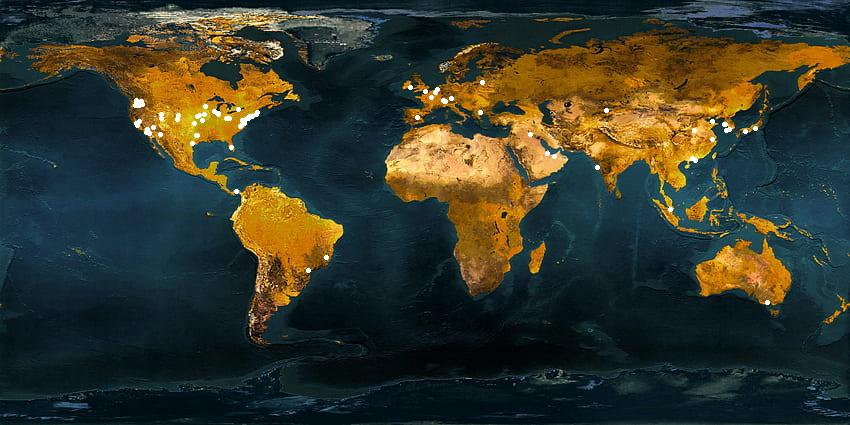

# IP Geolocation Visualization Project

This project consists of a series of Python scripts and tools designed to collect, process, and visualize IP address geolocation data. The goal is to plot the geographical locations of IP addresses on a world map, providing a visual representation of network traffic or other IP-related data.

## Components

### `connect_to_asa_and_process.py`

This script connects to a Cisco ASA device, retrieves logs, and processes them to extract IP addresses. It filters out private IP addresses and saves the remaining public IP addresses for further processing.

### `ipDataLookup.py`

This script takes an IP address as input and performs a geolocation lookup using an external API. It records the latitude and longitude of each IP address and saves this data in JSON format.

### `ip_data_counter.json`

A JSON file that keeps track of the number of API calls made to the geolocation service. This is used to ensure the usage limits of the API are not exceeded.

### `process_image.py`

This script reads the geolocation data (latitude and longitude) from the JSON files generated by `ipDataLookup.py` and plots these locations as dots on a world map image. The final image (`processed_image_with_dots.jpg`) shows the distribution of the IP addresses.

### `processed_image.jpg`

The base world map image used for plotting the IP address locations.

### `processed_image_with_dots.jpg`

The output image generated by `process_image.py`. It displays the world map with dots representing the geolocated IP addresses.

### `run_ip_lookup.sh`

A bash script that automates the execution of `connect_to_asa_and_process.py` and `ipDataLookup.py`. It is designed to be run at regular intervals via a cron job to continuously update the IP address data.

## Workflow

1. **Data Collection**: `connect_to_asa_and_process.py` collects IP addresses from a Cisco ASA device.
2. **Geolocation Lookup**: `ipDataLookup.py` performs geolocation lookups for each IP address and saves the data.
3. **Visualization**: `process_image.py` reads the geolocation data and plots it on the world map, resulting in `processed_image_with_dots.jpg`.

## Usage

To use this project:
1. Set up a cron job to run `run_ip_lookup.sh` regularly.
2. Ensure `ipDataLookup.py` has access to a valid geolocation API.
3. Run `process_image.py` to generate the updated visualization.

## Conclusion

This project provides a visual representation of IP address locations, useful for network traffic analysis, monitoring, and other IP-related investigations.
